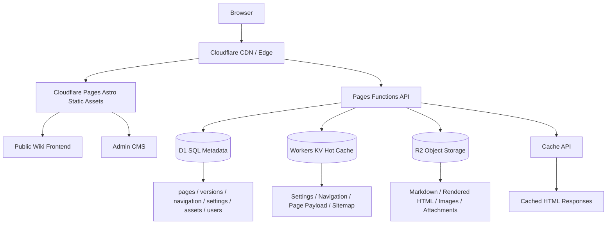

# Cloudflare Native Emby Wiki

## 生产级架构设计文档 v1.0

## 1. 项目目标

本项目是一个面向 Emby / 媒体服务器教程站的轻量级 Markdown Wiki 系统。它借鉴 Wiki.js、GitBook、Docusaurus、VitePress、Notion 的阅读体验，但不采用传统 Node.js 服务端架构。

第一版只做单站点：

- 一个 Emby Wiki 教程站
- 一个后台轻 CMS
- 一套 D1 / KV / R2 资源
- 不做多租户
- 但数据表保留 `site_id` 或类似可扩展空间时应尽量不阻碍未来 SaaS 改造

核心目标：

> 前台按静态文档站标准设计，后台按轻量 CMS 标准设计。

## 2. 平台约束

必须完全基于 Cloudflare 生态：

- Cloudflare Pages：承载 Astro 静态前端
- Cloudflare Pages Functions：提供 API 和动态文档响应
- Cloudflare D1：结构化数据库
- Cloudflare R2：图片、Markdown、渲染 HTML、附件
- Cloudflare KV：高频读取缓存
- Cloudflare Cache API：边缘 HTML 缓存
- JWT：后台登录认证
- Cloudflare Access：可选的后台外层保护

禁止：

- VPS
- Docker
- 独立 Node.js 常驻服务
- MySQL / PostgreSQL 独立服务
- 把大量二进制文件写进数据库

Cloudflare Pages Functions 可以通过 bindings 接入 D1、R2、KV 等资源。D1 适合存储结构化数据，但单数据库容量限制为 10GB，因此应避免存储图片、大 HTML、大 Markdown blob。R2 适合对象存储，KV 适合热缓存，Cache API 适合边缘响应缓存。

## 3. 技术选型

### 3.1 前端

- Astro
- TypeScript
- React Islands
- TailwindCSS

选择 Astro 的原因：

1. 文档阅读站更接近静态站。
2. 默认客户端 JS 更少。
3. 首屏性能更容易做好。
4. 后台管理可以局部使用 React Islands。
5. 比 Next.js 更轻，更适合 Cloudflare Pages 静态优先部署。

### 3.2 API

- Cloudflare Pages Functions

理由：

1. 与 Pages 项目共存。
2. 文件路由清晰。
3. 通过 bindings 访问 D1 / KV / R2。
4. 不需要单独维护 Workers 项目。

### 3.3 Markdown

第一版使用：

- markdown-it
- markdown-it-anchor
- markdown-it-container
- markdown-it-footnote
- markdown-it-katex
- markdown-it-task-lists

后续可以升级到：

- unified
- remark
- rehype
- rehype-sanitize
- rehype-shiki

### 3.4 编辑器

第一版：

- CodeMirror 6
- React wrapper `@uiw/react-codemirror`

原因：

1. 直接编辑 Markdown 源码。
2. 技术文档作者更容易接受。
3. 性能稳定。
4. 可扩展快捷键、预览、上传粘贴等能力。

## 4. 总体架构



## 5. 请求模型

### 5.1 公开页面读取

用户访问：

```txt
/docs/emby/docker
```

流程：

1. 请求进入 Cloudflare Edge。
2. Pages Function `functions/docs/[[slug]].ts` 接收。
3. 检查旧 slug redirect。
4. 检查 Cache API。
5. Cache 命中则直接返回 HTML。
6. Cache 未命中则查 KV：`page:slug:{slug}:latest`。
7. KV 命中则返回渲染后的 HTML payload。
8. KV 未命中则查 D1 页面元数据。
9. 从 R2 读取 rendered HTML snapshot。
10. 组装完整 HTML。
11. 写入 KV。
12. 写入 Cache API。
13. 返回响应。

核心原则：

> 前台访问不应该每次实时解析 Markdown。Markdown 解析发生在发布时，访问时只读取缓存或渲染快照。

### 5.2 后台编辑发布

1. 管理员登录 `/admin/login`。
2. JWT 鉴权。
3. 进入 `/admin`。
4. 编辑页面 Markdown。
5. 点击保存草稿：写入 R2 Markdown + D1 `page_versions` draft。
6. 点击发布：渲染 Markdown 为 HTML。
7. HTML snapshot 写入 R2。
8. 页面元数据写入 D1。
9. 最新页面 payload 写入 KV。
10. 更新 sitemap / navigation 缓存。
11. 前台新版本可访问。

## 6. 数据分层

| 层 | 职责 | 示例 |
|---|---|---|
| D1 | 结构化元数据、关系、权限 | pages, page_versions, navigation, users |
| R2 | 大对象和文件 | Markdown, HTML snapshot, images, attachments |
| KV | 高频热数据 | settings, navigation tree, page latest payload |
| Cache API | 边缘响应缓存 | `/docs/emby/docker` HTML |
| CDN | 静态资源缓存 | CSS, JS, favicon, uploaded images |

不要把下列内容放进 D1：

- 图片二进制
- 视频文件
- 大附件
- 很长的 HTML snapshot
- 大 Markdown 文档集合

D1 只负责索引和关系。

## 7. 源码结构

```txt
cf-native-emby-wiki/
├── CODEX_START_HERE.md
├── README.md
├── package.json
├── wrangler.toml
├── astro.config.mjs
├── migrations/
│   ├── 0001_init.sql
│   ├── 0002_indexes.sql
│   ├── 0003_seed_settings.sql
│   └── 0004_seed_demo_content.sql
├── src/
│   ├── pages/
│   │   ├── index.astro
│   │   └── admin/
│   │       ├── login.astro
│   │       └── index.astro
│   ├── components/admin/AdminApp.tsx
│   ├── layouts/BaseLayout.astro
│   └── styles/global.css
├── functions/
│   ├── _lib/
│   │   ├── auth.ts
│   │   ├── cache.ts
│   │   ├── http.ts
│   │   ├── id.ts
│   │   ├── markdown.ts
│   │   ├── navigation.ts
│   │   ├── page-service.ts
│   │   ├── render-page.ts
│   │   ├── settings.ts
│   │   ├── slug.ts
│   │   └── types.ts
│   ├── api/
│   ├── assets/[[path]].ts
│   ├── docs/[[slug]].ts
│   ├── sitemap.xml.ts
│   └── robots.txt.ts
├── public/
│   ├── assets/wiki.css
│   ├── assets/wiki.js
│   └── _headers
├── scripts/
│   └── generate-password-hash.mjs
└── docs/
```

## 8. 数据库实体

主要实体：

1. users
2. pages
3. page_versions
4. slug_redirects
5. navigation
6. assets
7. settings
8. audit_logs

关系：

```txt
users
  └── pages.created_by / pages.updated_by

pages
  ├── page_versions.page_id
  ├── navigation.page_id
  └── slug_redirects.page_id

assets
  └── Markdown content references asset public URLs

settings
  └── public site configuration

navigation
  └── left sidebar tree structure
```

## 9. Slug 系统

### 9.1 目标 URL

```txt
/docs/emby/install
/docs/emby/docker
/docs/emby/nginx
/docs/cloudflare/r2-cors
```

### 9.2 规则

1. 自动生成 slug。
2. 支持手动修改 slug。
3. `normalized_slug` 唯一。
4. 旧 slug 自动 301 到新 slug。
5. slug 建议英文、短、稳定。
6. 中文标题可手动指定英文 slug。

### 9.3 修改 slug 流程

```txt
old: /docs/emby/install
new: /docs/emby/docker-install
```

执行：

1. 更新 `pages.slug`。
2. 插入 `slug_redirects`。
3. 刷新 KV latest key。
4. 删除或等待旧 Cache API 过期。
5. 旧 URL 访问时返回 301。

## 10. Markdown 渲染能力

必须支持：

- GitHub 风格 Markdown
- code block
- table
- task list
- admonition
- heading anchor
- 图片
- 视频嵌入
- Mermaid
- 数学公式
- 自动 TOC
- 脚注
- 图片懒加载
- 表格横向滚动

发布时产出：

```txt
Markdown source
  -> HTML body
  -> TOC JSON
  -> reading time
  -> word count
  -> content hash
  -> rendered R2 key
```

## 11. 缓存设计

### 11.1 KV Key

```txt
site:settings:public
site:navigation:tree
site:sitemap:xml
site:robots:txt

page:slug:{slug}:latest
page:id:{pageId}:meta
page:id:{pageId}:toc
page:id:{pageId}:version:{versionId}:html
page:id:{pageId}:version:{versionId}:markdown

redirect:slug:{oldSlug}
```

### 11.2 Cache-Control

公开页面：

```http
Cache-Control: public, max-age=60, s-maxage=86400
CDN-Cache-Control: public, max-age=86400
ETag: "pageId-versionId-contentHash"
```

后台和写接口：

```http
Cache-Control: no-store
```

静态资源：

```http
Cache-Control: public, max-age=31536000, immutable
```

### 11.3 SWR 策略

Cloudflare Cache API 的 `cache.put()` / `cache.match()` 不支持 `stale-while-revalidate` 指令，因此应用层应通过 `ctx.waitUntil()` 手动做后台刷新。

基本逻辑：

```ts
const cached = await caches.default.match(request);
if (cached) return cached;
const response = await renderFromKVOrD1(request, env);
ctx.waitUntil(caches.default.put(request, response.clone()));
return response;
```

## 12. R2 资源系统

R2 路径建议：

```txt
/assets/images/2026/05/{assetId}.webp
/assets/original/2026/05/{assetId}.png
/content/pages/{pageId}/{versionId}.md
/rendered/pages/{pageId}/{versionId}.html
```

上传流程：

1. 浏览器拖拽或粘贴图片。
2. 前端压缩到合适尺寸。
3. 优先转换 WebP。
4. POST `/api/assets/upload`。
5. Worker 校验 JWT。
6. 校验 MIME 和大小。
7. 写入 R2。
8. 写入 `assets` 表。
9. 返回 Markdown 图片语法。

返回示例：

```json
{
  "id": "asset_123",
  "url": "/assets/images/2026/05/asset_123.webp",
  "markdown": ""
}
```

## 13. 后台 CMS 设计

后台路径：

```txt
/admin/login
/admin
```

后台模块：

- Dashboard
- Pages
- Navigation
- Assets
- Settings
- Versions
- Audit Logs

页面编辑器布局：

```txt
Title
Slug
Status

┌─────────────────────┬─────────────────────┐
│ Markdown Editor     │ Live Preview        │
└─────────────────────┴─────────────────────┘

Save Draft | Publish | Versions | Delete
```

第一版后台不做复杂权限协作，只需要：

- admin
- editor

未来再扩展 owner / viewer。

## 14. 前台 UI 设计

桌面布局：

```txt
┌────────────────────────────────────────────┐
│ Top Bar                                    │
├──────────────┬────────────────┬────────────┤
│ Left Sidebar │ Main Article   │ Right TOC  │
│ 280px        │ 860px max      │ 220px      │
└──────────────┴────────────────┴────────────┘
```

移动端：

```txt
Top Bar + Menu Button
Article
Floating TOC / Drawer
```

风格：

- 极简
- 高级灰
- 技术文档感
- 深色模式精致
- 代码块高质量
- 当前页面高亮
- 父级自动展开
- 图片灯箱
- Skeleton loading

## 15. SEO 设计

每篇页面应支持：

- title
- meta description
- canonical URL
- OpenGraph title
- OpenGraph description
- OpenGraph image
- structured data `TechArticle`
- sitemap entry
- old slug 301 redirect

不要用纯客户端渲染正文。

公开页面必须服务端输出完整 HTML。

## 16. 安全设计

### 16.1 JWT

- 登录成功后返回 JWT。
- JWT 包含 user id、role、过期时间。
- 后台 API 校验 Bearer token。
- 生产建议使用 HttpOnly Cookie 或短期 token。

### 16.2 上传安全

- 限制文件大小。
- 限制 MIME 类型。
- 禁止 SVG 直接作为可执行内容嵌入，除非 sanitize。
- R2 key 使用随机 ID。
- 不信任原文件名。

### 16.3 Markdown 安全

必须 sanitize HTML。

iframe 白名单：

- YouTube
- Bilibili
- Vimeo
- 自定义可信媒体域名

禁止任意 `<script>`。

## 17. 发布流程

```txt
Admin saves draft
  -> R2 Markdown draft
  -> D1 page_versions draft

Admin publishes
  -> render Markdown
  -> R2 rendered HTML
  -> D1 pages current_version_id
  -> KV page latest
  -> KV settings/navigation/sitemap if needed
  -> Cache API invalidation/rebuild path
```

## 18. 未来 SaaS 扩展预留

第一版不实现多租户，但要避免架构锁死。

未来可添加：

- `sites` 表
- `site_id` 字段
- 每个站点独立 KV prefix
- 每个站点独立 R2 prefix
- 每个站点独立 D1 或同库逻辑隔离
- 自定义域名
- 用户角色按站点授权

第一版可以先用隐含单站点：

```txt
site_id = default
```

但不必暴露在 UI。

## 19. 生产部署目标

最终应达到：

1. `npm run build` 成功。
2. Cloudflare Pages 部署成功。
3. D1 迁移成功。
4. KV / R2 bindings 正常。
5. 后台登录正常。
6. 页面创建、草稿、发布正常。
7. `/docs/:slug` 返回完整 HTML。
8. 图片上传到 R2 并可被 Markdown 使用。
9. sitemap 自动生成。
10. 静态资源和页面缓存头正确。

## 20. 总结

本项目不是传统 CMS，也不是完整复制 Wiki.js。它的核心是：

> 用 Cloudflare 原生能力实现一个带编辑后台的高性能静态化 Wiki 文档系统。

最重要的工程判断：

- D1 只做结构化数据。
- R2 存储内容和资源。
- KV 存热数据。
- Cache API 做 HTML 边缘缓存。
- Astro 负责静态优先前端。
- Pages Functions 负责 API 和动态文档响应。
- 发布时渲染 Markdown，访问时读取缓存。

